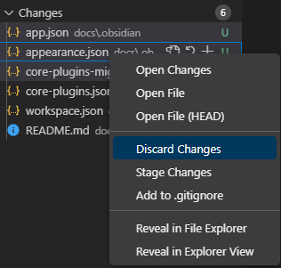
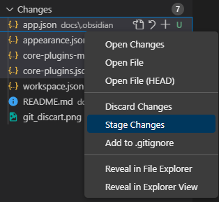
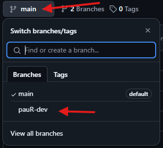
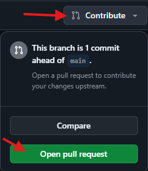
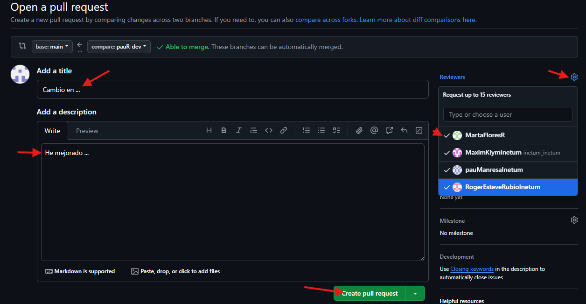
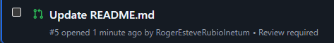
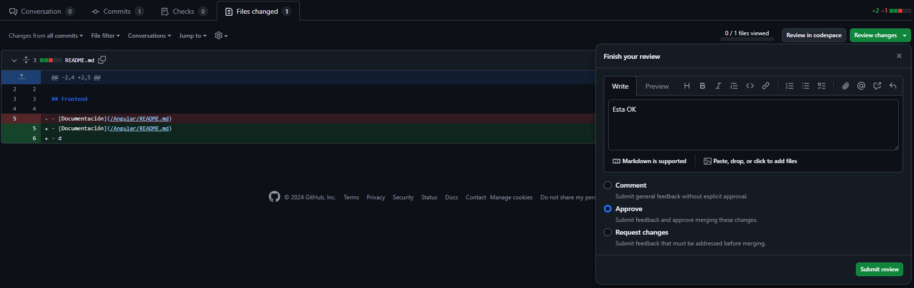
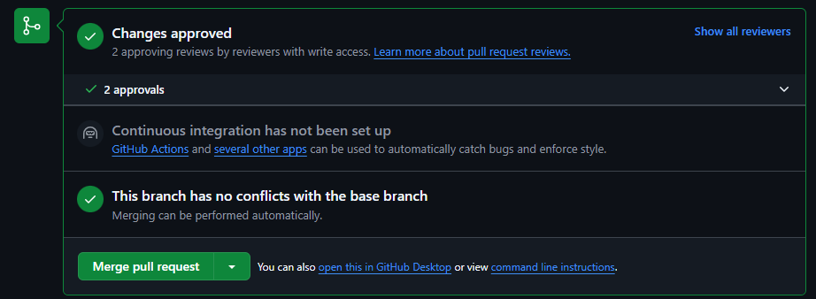

# Guía para usar Git

## Pasos para subir a la rama `main`

> [!IMPORTANT]
> Los pasos **3**, **4** y **5** son de vital importancia.  
> **NO** se debe usar `git add .`

1. **Crear una rama de desarrollo:**

   ```bash
   git branch nombre-dev
   ```

   > Solo la primera vez. Cambia `nombre-dev` por tu nombre (ej., `pauR-dev`).

2. **Cambiar a la rama de desarrollo:**

   ```bash
   git switch nombre-dev
   ```

3. **Cerrar Visual Studio 2022 y abrir Visual Studio Code.**

4. **Descartar cambios no realizados por ti:**  
   Selecciona múltiples cambios con `Ctrl` o `Shift`.

   

5. **Agregar solo tus cambios:**  
   Utiliza la opción `"Stage Changes"`. Selecciona varios archivos con `Ctrl` o `Shift`.

   

6. **Crear un commit:**

   ```bash
   git commit -m "CAMBIOS HECHOS"
   ```

7. **Actualizar repositorio local (si es necesario):**

   ```bash
   git pull
   ```

8. **Subir cambios a la rama remota:**

   ```bash
   git push -u origin nombre-dev
   ```

   > `nombre-dev` es la rama creada en el paso 1.

9. **Abrir el proyecto en GitHub y acceder a tu rama:**

   

10. **Abrir la PR (Pull Request):**

    

11. **Crear la PR:**

    - El título y la descripción deben ser descriptivos e intuitivos.
    - Añadir los revisores necesarios (mínimo 2 o todos).

    

---

## Aceptar una PR

1. **Acceder a la sección de Pull Requests en GitHub Web.**

   

2. **Entrar en la PR.**

   

3. **Revisar y testear los cambios localmente:**

   ```bash
   git switch nombre-dev
   ```

   

4. **Realizar el merge (último revisor).**

   

5. **Eliminar la rama una vez finalizado el merge.**

   

---

## Actualizar una rama secundaria basada en `main`

> `main` puede ser sustituida por cualquier otra rama actualizada.

1. **Cambiar a la rama secundaria:**

   ```bash
   git checkout nombre-de-la-rama-secundaria
   ```

   > Por ejemplo, `pauR-dev`.

2. **Actualizar la rama `main` local:**

   ```bash
   git checkout main
   git pull origin main
   ```

3. **Volver a la rama secundaria:**

   ```bash
   git checkout nombre-de-la-rama-secundaria
   ```

4. **Realizar el merge de los cambios de `main` en la rama secundaria:**

   ```bash
   git merge main
   ```

5. **Subir los cambios a la rama remota secundaria:**
   ```bash
   git push origin nombre-de-la-rama-secundaria
   ```

---

## Crear 2 PR distintas usando 2 ramas de desarrollo

1. **Crear la primera rama de desarrollo:**

   ```bash
   git branch nombre-dev1
   ```

   > Cambia `nombre-dev1` por tu nombre y el propósito de la rama (ej., `pauR-featureA`).

2. **Cambiar a la primera rama de desarrollo:**

   ```bash
   git switch nombre-dev1
   ```

3. **Realizar cambios en la primera rama.**

4. **Crear un commit para la primera rama:**

   ```bash
   git commit -m "Descripción de cambios en nombre-dev1"
   ```

5. **Subir la primera rama al repositorio remoto:**

   ```bash
   git push -u origin nombre-dev1
   ```

6. **Crear una PR para la primera rama en GitHub:**

   - Sigue los pasos descritos en la sección “Crear la PR”.
   - Asegúrate de asignar revisores y añadir una descripción clara para la primera PR.

7. **Crear la segunda rama de desarrollo desde `main`:**

   ```bash
   git checkout main
   git branch nombre-dev2
   ```

   > Cambia `nombre-dev2` por tu nombre y el propósito de la rama (ej., `pauR-featureB`).

8. **Cambiar a la segunda rama de desarrollo:**

   ```bash
   git switch nombre-dev2
   ```

9. **Realizar cambios en la segunda rama.**

10. **Crear un commit para la segunda rama:**

    ```bash
    git commit -m "Descripción de cambios en nombre-dev2"
    ```

11. **Subir la segunda rama al repositorio remoto:**

    ```bash
    git push -u origin nombre-dev2
    ```

12. **Crear una PR para la segunda rama en GitHub:**

    - Sigue nuevamente los pasos para abrir una PR.
    - Añade revisores y asegúrate de una descripción que identifique claramente los cambios de la segunda PR.